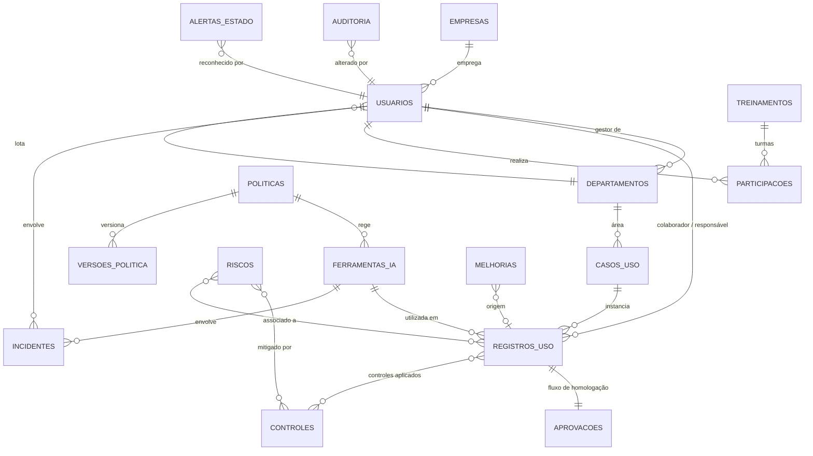

# Painel de Governança e Segurança da IA — Arquitetura

> Módulo do ambiente gerencial do Grupo Pirâmide Cicllos.
> Lógica central: **HOMOLOGAR → ORIENTAR → CONTROLAR → MONITORAR → EVOLUIR**

---

## 1. Análise do projeto existente

| Item | Situação encontrada |
|---|---|
| Tecnologia | React 19 + TypeScript 5.8 + Vite 6 (projeto gerado no Google AI Studio) |
| Estilo | Tailwind CSS via CDN (`index.html`), fonte Inter, paleta `blue-900` / `slate` |
| Gráficos | Recharts 3 |
| Ícones | lucide-react |
| IA | `@google/genai` (Gemini) em `services/geminiService.ts`, opcional via `.env` |
| Dados | `localStorage` (`cicllos_risks`, `cicllos_docs`) com mocks em `constants.ts` |
| Backend / BD | **Não existe.** Não há API, autenticação ou banco de dados |
| Estrutura | Um único componente `App.tsx` (~1.100 linhas) com 4 abas: Visão Geral, Políticas e Normas, Gerenciar Dados, Análise IA |
| Testes / lint | Não há suíte de testes nem linter configurados; validação disponível: `tsc --noEmit` e `vite build` |

**Conclusão:** o projeto já é um painel gerencial (Gestão de Riscos e Compliance). Conforme a regra 25, o
novo módulo é **incorporado** a ele — acessado pelo menu lateral existente — e não criado como aplicação isolada.

## 2. Arquitetura proposta

O módulo vive em uma pasta própria, com camadas bem separadas, para não inflar o `App.tsx` e para permitir
trocar a fonte de dados no futuro sem reescrever telas.

```
modules/ai-governance/
├── AIGovernanceModule.tsx   → casca do módulo (menu lateral, cabeçalho, perfil, filtros globais, roteamento)
├── domain/
│   ├── types.ts             → entidades, enums e contratos (fonte única da verdade do modelo)
│   └── catalogs.ts          → listas de domínio (status, tipos de dado, etapas do fluxo, rótulos)
├── data/
│   ├── seed.ts              → dados FICTÍCIOS de demonstração
│   └── repository.ts        → interface GovernanceRepository + implementação LocalStorage (versão de schema)
├── services/                → regras de negócio puras (sem React) — testáveis e reaproveitáveis
│   ├── riskEngine.ts        → classificação de risco transparente (fatores + pontos + regras de piso)
│   ├── permissions.ts       → RBAC: perfis, permissões e escopo de dados
│   ├── workflow.ts          → fluxo de homologação (8 etapas) e transições de status
│   ├── audit.ts             → geração de trilha de auditoria (diff campo a campo)
│   ├── alertEngine.ts       → central de alertas derivada das regras de governança
│   ├── metrics.ts           → filtros globais, KPIs e agregações para gráficos
│   ├── export.ts            → exportação CSV / JSON (PDF e Excel previstos)
│   └── automation.ts        → barramento de eventos de domínio (ponto de integração futuro)
├── state/
│   └── GovernanceContext.tsx → estado global do módulo; toda gravação passa por aqui (auditoria + eventos)
├── components/              → UI reutilizável (Badge, Card, KpiCard, ChartCard, Modal, FilterBar, ...)
└── pages/                   → uma página por item de menu
```

### Princípios de implementação

1. **Regras fora das telas.** Risco, permissões, alertas e fluxo são funções puras em `services/`.
2. **Gravação única.** Toda alteração passa por `GovernanceContext` → gera auditoria → dispara evento → persiste.
3. **Sem duplicação.** O registro de uso guarda só `colaboradorId`; departamento, empresa e cargo são derivados.
4. **Fonte de dados plugável.** As telas dependem da interface `GovernanceRepository`, não do `localStorage`.
5. **Transparência.** Nenhum cálculo é "caixa preta": o risco sempre exibe fatores, pontos e regras aplicadas.

## 3. Entidades e relacionamentos



| Tabela (seção 20) | Entidade TS | Observação |
|---|---|---|
| USUARIOS | `Usuario` | Colaborador + perfil de acesso (RBAC) |
| DEPARTAMENTOS | `Departamento` | `gestorId` → Usuario |
| EMPRESAS | `Empresa` | Empresas do Grupo |
| FERRAMENTAS_IA | `FerramentaIA` | Categoria de homologação, riscos, permissões, restrições, política |
| CASOS_USO | `CasoUso` | Catálogo/biblioteca (modelo reutilizável) |
| — | `RegistroUso` | "Registro de Uso de IA" (instância concreta por colaborador) |
| APROVACOES | `Aprovacao` | Fluxo de 8 etapas com responsável, data, status, observação |
| RISCOS | `RiscoIA` | Registro de riscos corporativos de IA (probabilidade × impacto) |
| CONTROLES | `Controle` | Preventivo / Detectivo / Corretivo |
| TREINAMENTOS | `Treinamento` + `Participacao` | Catálogo de cursos e participação individual |
| INCIDENTES | `Incidente` | Tipos e status da seção 14 |
| POLITICAS | `Politica` (+ `versoes[]`) | Regras e histórico de versões |
| AUDITORIA | `EventoAuditoria` | Quem, o quê, antes/depois, data/hora |
| ALERTAS | `AlertaEstado` | Alertas são **derivados** das regras; só o reconhecimento é persistido |
| — | `Melhoria` | Pilar EVOLUIR |

## 4. Classificação de risco (transparente)

Pontuação aditiva — cada fator exibe seus pontos e o motivo:

| Fator | Pontos |
|---|---|
| Ferramenta: Homologada / Mediante aprovação / Não homologada | 0 / 2 / 4 |
| Exposição externa (dados saem do ambiente corporativo) | +2 |
| Dado pessoal | +2 |
| Dado sensível (LGPD art. 5º, II) | +4 |
| Dado de cliente (apólices, sinistros, cadastros) | +3 |
| Informação financeira | +2 |
| Informação contratual | +2 |
| Informação estratégica / confidencial | +3 |
| Impacto no processo: Baixo / Médio / Alto | 0 / 1 / 3 |
| Grau de automação: Assistido / Parcial / Automatizado | 0 / 1 / 3 |
| Decisão humana: Sempre revisa / Amostral / Sem revisão | 0 / 1 / 3 |

Faixas: **0–4 Baixo · 5–9 Médio · 10–15 Alto · ≥16 Crítico**.

Regras de piso (sobrepõem a soma, e são exibidas):
- Dado sensível em ferramenta não homologada → **Crítico**.
- Dado de cliente ou contratual em ferramenta não homologada → mínimo **Alto**.
- Processo automatizado sem revisão humana → mínimo **Alto**.

Os pesos e faixas ficam em `Configurações` (editáveis pelo Administrador). Um avaliador pode **ajustar** o nível
sugerido, mas o ajuste exige justificativa e fica registrado na auditoria.

**Necessita aprovação** = ferramenta não homologada **ou** risco ≥ Alto **ou** dado sensível **ou** dado de cliente.
Casos em ferramenta homologada com risco Baixo seguem aprovação automática por política (registrada no fluxo).

## 5. Perfis e permissões (RBAC)

| Permissão | Admin | Gestor | Auditor | Diretoria | Colaborador |
|---|:-:|:-:|:-:|:-:|:-:|
| Visão executiva | ✔ | ✔ | ✔ | ✔ | — |
| Escopo de dados | Tudo | Sua área | Tudo | Tudo | Seus registros |
| Registrar / solicitar uso | ✔ | ✔ | — | — | ✔ |
| Aprovar (risco ≤ Médio) | ✔ | ✔ (sua área) | — | — | — |
| Aprovar (risco Alto/Crítico) | ✔ | — | — | — | — |
| Ferramentas / Políticas / Treinamentos (gestão) | ✔ | — | — | — | — |
| Incidentes: registrar / tratar | ✔ / ✔ | ✔ / ✔ | ✔ / — | — | ✔ / — |
| Auditoria | ✔ | — | ✔ | ✔ | — |
| Configurações | ✔ | — | — | — | — |
| Exportar relatório | ✔ | ✔ | ✔ | ✔ | — |

> **Importante:** o projeto não possui backend nem login. Nesta fase o perfil é selecionado em
> "Simular perfil" e as permissões são aplicadas na interface e na camada de estado. A segurança efetiva
> exige autenticação (SSO Google Workspace) e validação no servidor — prevista na arquitetura futura.

## 6. Páginas (menu lateral)

| Menu | Conteúdo |
|---|---|
| 🏠 Visão Geral | **Painel Executivo**: KPIs, 5 pilares, principais pontos de atenção, 10 gráficos |
| 🛡 Governança da IA | **Registro de Uso de IA** (inventário), assistente "+ Solicitar nova utilização de IA", detalhe com fluxo |
| 👥 Colaboradores | Busca e ficha individual (ferramentas, finalidades, aprovações, treinamentos, incidentes) |
| 🏢 Departamentos | Mapa de uso por área + detalhamento |
| 🤖 Ferramentas de IA | Catálogo com homologação, risco, usuários, casos de uso, restrições |
| 📋 Casos de Uso | Biblioteca de casos de uso |
| ✅ Aprovações | Fila de aprovação e condução das 8 etapas |
| ⚠ Riscos e Alertas | Registro de riscos, matriz e Central de Alertas |
| 🚨 Incidentes | Registro e tratamento |
| 🎓 Treinamentos | Capacitação em IA (% treinados, pendentes, vencidos) |
| 📑 Políticas | Políticas, regras e versões |
| 🔎 Auditoria | Trilha de auditoria com filtros |
| ⚙ Configurações | Perfis, pesos da matriz, cadastros de apoio, dados de demonstração |

## 7. Fluxo de dados

```
Tela ──ação──▶ GovernanceContext.mutate()
                 ├─ verifica permissão (permissions.ts)
                 ├─ aplica regra de negócio (riskEngine / workflow)
                 ├─ gera EventoAuditoria (audit.ts: diff antes/depois)
                 ├─ publica evento de domínio (automation.ts)  ──▶ [futuro] e-mail, Apps Script, webhooks
                 └─ persiste via GovernanceRepository ──▶ LocalStorage hoje / Sheets / API amanhã

Leitura: estado ─▶ escopo do perfil ─▶ filtros globais (metrics.ts) ─▶ KPIs, gráficos, tabelas
Alertas: estado ─▶ alertEngine (regras) ─▶ Central de Alertas (reconhecimento persistido)
```

## 8. Conflitos e riscos identificados com o sistema atual

| Ponto | Tratamento |
|---|---|
| `types.ts` já possui `RiskLevel` (Pequeno…Crítico) com outra escala | Módulo usa tipos próprios em `modules/ai-governance/domain` — sem colisão |
| `App.tsx` monolítico | Alteração mínima: um item de menu e um `if` que monta o módulo (carregado sob demanda) |
| Chaves de `localStorage` | Prefixo exclusivo `cicllos_aigov_*` |
| Seletor de unidade (Seguradora / Ciclos Pay) | Mantido no painel de riscos; no módulo vira o filtro global "Empresa" |
| Bundle > 500 kB | Módulo carregado com `React.lazy` (code splitting) |
| Tailwind via CDN (sem build) | Cores da identidade definidas via `tailwind.config` inline no `index.html` |
| Ausência de autenticação | Perfil simulado + RBAC na camada de estado; SSO é pré-requisito para produção |

## 9. Integrações futuras (preparadas, não implementadas)

- `GovernanceRepository` → adaptadores `GoogleSheetsRepository`, `RestApiRepository`.
- `automation.ts` → assinantes para e-mail, Google Chat, Apps Script (gatilhos), webhooks.
- `export.ts` → CSV/JSON hoje; PDF e Excel; feed para Power BI.
- `riskEngine.ts` → ponto de extensão para análise de risco assistida por IA (sugestão, nunca decisão).
- Inventário automático (logs do Google Workspace / proxy) alimentando alertas de "ferramenta não homologada".

## 10. Plano de etapas

| Etapa | Escopo |
|---|---|
| **1** | Fundação (modelo, repositório, motores de risco/permissão/auditoria/alertas/fluxo), integração ao painel, Visão Geral (Painel Executivo) e Registro de Uso com assistente condicional |
| 2 | Aprovações (condução das 8 etapas), Ferramentas, Casos de Uso |
| 3 | Colaboradores, Departamentos, Riscos e Alertas |
| 4 | Incidentes, Treinamentos, Políticas (versões) |
| 5 | Auditoria, Configurações, relatório executivo e exportações |
| 6 | Integrações (Sheets/Apps Script/e-mail), SSO e backend |
